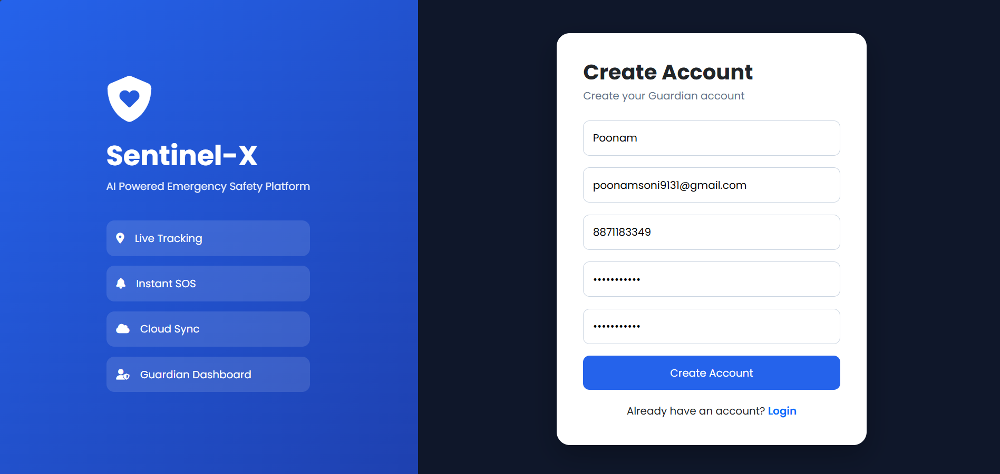
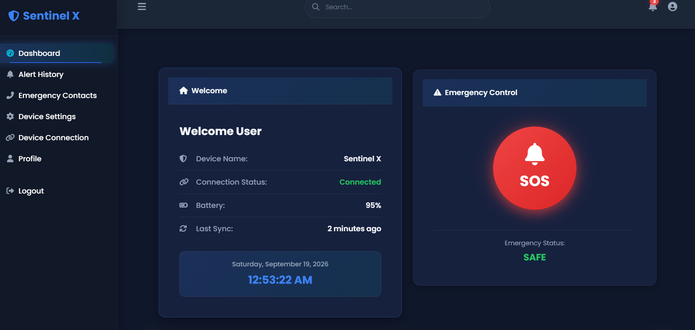
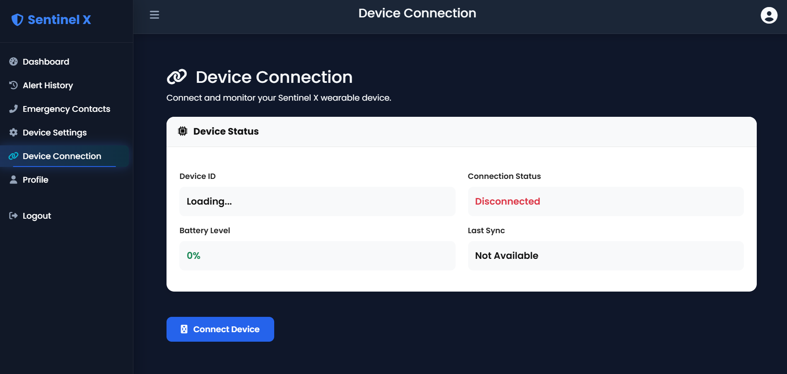
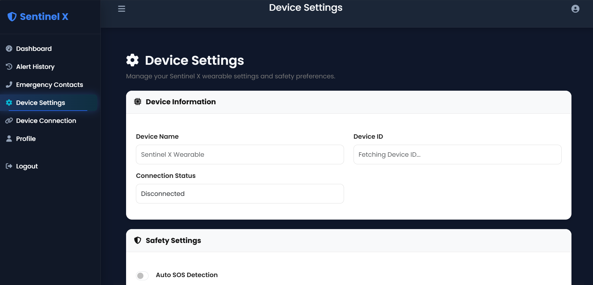
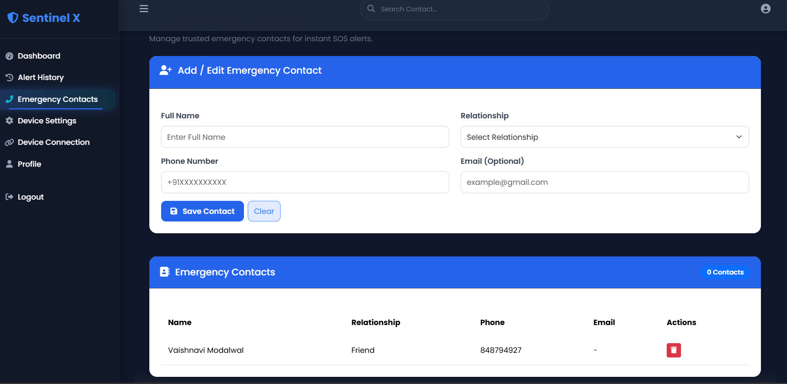
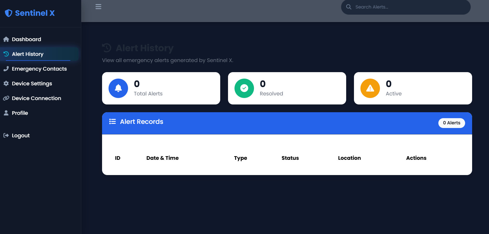
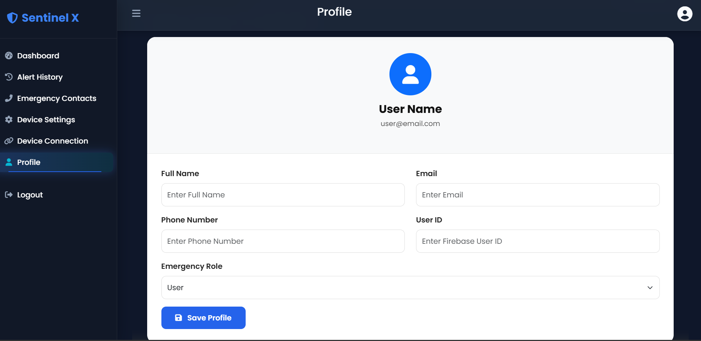

# Sentinel-X 🛡️

### AI-Assisted Emergency Safety Wearable for Real-Time Alerts, Location Tracking & Smart Emergency Response

Sentinel-X is a smartphone-independent emergency safety wearable designed to provide quick assistance during critical situations.

The system combines an embedded device, GPS/GNSS, cellular communication, motion sensing, emergency alerts, and a web-based dashboard to support real-time monitoring and emergency response.

---

## 📌 Problem Statement

During an emergency, depending completely on a smartphone may not always be practical. A person may be unable to access their phone, have limited connectivity, or need to send an emergency alert quickly.

Sentinel-X aims to provide a dedicated wearable solution that can detect emergency situations, obtain the user's location, and notify predefined emergency contacts.

---

## 💡 Our Solution

Sentinel-X provides a compact safety system that can work independently of a smartphone.

When an emergency is triggered, the device can:

- Detect or initiate an emergency event
- Provide a short countdown to reduce false alerts
- Send an SOS alert
- Obtain the user's location using GPS/GNSS
- Communicate through cellular connectivity
- Provide audio/vibration feedback
- Store emergency information for later monitoring

A connected dashboard can also be used to monitor device status, emergency history, contacts, and other relevant information.

---

## ✨ Key Features

- 🚨 One-tap SOS emergency alert
- ⏱️ Emergency countdown with false-alert cancellation
- 📍 GPS/GNSS-based location tracking
- 📡 Cellular communication without requiring a smartphone
- 🔔 Buzzer and vibration feedback
- 💓 Motion and health-related sensing support
- 🔋 Device battery/status monitoring
- 👥 Predefined emergency contacts
- 📊 Emergency history and monitoring dashboard
- 🔄 Device synchronization and status monitoring
- 🔐 Firebase-based data and settings management

---

## 🛠️ Technology Stack

### Hardware 
- ESP32 / ESP32-S3
- SIM7600-series 4G LTE + GNSS module
- MPU6050
- MAX30102
- Buzzer
- Vibration motor
- GPS/GNSS
- Optional environmental sensors

### Software
- HTML
- CSS
- JavaScript
- Bootstrap 5
- Firebase
- Git & GitHub

---
### Other Components
The complete Sentinel-X system also involves hardware and backend components developed as part of the team project.

## 👩‍💻 My Contribution

My primary contribution to the Sentinel-X project was **Frontend Development**.

I designed and developed the user-facing web interface, including:

- 🏠 Landing Page
- 🔐 Login Page
- 📊 Dashboard
- 📱 Device Connection Interface
- ⚙️ Device Settings
- 🚨 Emergency Contacts
- 📜 Alert History
- 👤 Profile Page
- 🚪 Logout Interface
- 📱 Responsive and user-friendly UI design

I also organized the frontend files and project screenshots for documentation and presentation.

> **Note:** Hardware, backend, and other system components were developed as part of the team project.

## 📸 Screenshots

### 🏠 Landing Page

### 🔐 Login Page

### 📊 Dashboard

### 📱 Device Connection

### ⚙️ Device Settings

### 🚨 Emergency Contacts

### 📜 Alert History

### 👤 Profile

## 🎯 Target Users

Sentinel-X is designed for situations where quick emergency communication and location sharing can be important, including:

Students
Travelers
Individuals working in isolated environments
Elderly users
People requiring an additional personal safety device
🔮 Future Scope

## Future versions of Sentinel-X can include:

AI-based emergency event detection
Improved health monitoring
Fall detection and activity recognition
Voice-based emergency activation
Advanced geofencing
Mobile and cloud notification integration
Improved power optimization
More compact wearable hardware
## 👥 Team

Project: Sentinel-X

Domain: IoT • Embedded Systems • AI/ML • Emergency Safety

## 📄 License

This project is developed for educational and project-development purposes.

